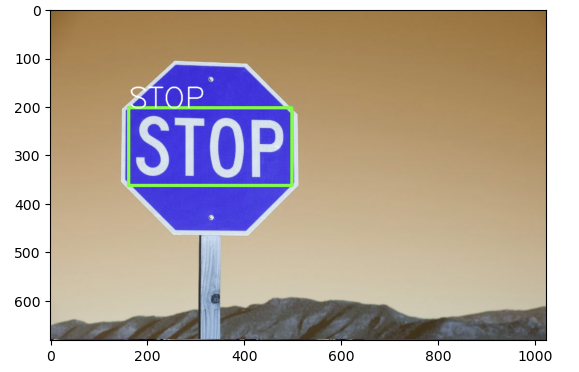

# Projects Portfolio

Welcome to my Data Science portfolio! Here are some of the projects I have worked on:

## [Project 1: Forecasting Residential Property Values in Malaysia](https://github.com/naimzol/Forecasting-Property-Values-Machine-Learning)

**Description**: This project focuses on predicting residential property values in Malaysia using **machine learning** techniques. Key features include data cleaning, feature engineering, and using Linear, Lasso and Ridge regression models.

**Tools and Libraries**: Python, Pandas, Scikit-learn, Matplotlib, Seaborn

**Key Features**:
- Data preprocessing and cleaning
- Feature engineering
- Outlier detection
- Model training and evaluation using Linear, Lasso and Ridge regression

## [Project 2: KLSE Stock Data Analysis](https://github.com/naimzol/KLSE-Stock-Data-Analysis)

**Description**: This project involves analyzing KLSE stock data using various **timeseries analysis** techniques.

**Tools and Libraries**: Python, Pandas, Matplotlib, Seaborn

**Key Features**:
- Time series data preprocessing and cleaning
- Resampling and visualization of time series data
- Analysis of stock trends and patterns
- Quarterly Time Period Analysis

  

## [Project 3: OCR Word Detection](https://github.com/naimzol/OCR-Word-Detection)

**Description**: This project leverages advanced image processing and machine learning techniques to detect and extract words from images using Python, EasyOCR, PyTorch, and OpenCV.

**Tools and Libraries**: Python, EasyOCR, PyTorch, OpenCV

**Key Features**:
- Image preprocessing and enhancement
- OCR model implementation using EasyOCR
- Word detection and extraction from images
- Visualization of detected words on images

## [Project 4: Paddy Disease Classification](https://github.com/naimzol/Paddy-Disease-Classification)

**Description**: This deep learning project involves using TensorFlow and CNN for image classification of paddy diseases, including data augmentation and the use of the Adam optimizer.

**Technologies Used**: Python, TensorFlow, Keras, OpenCV

**Key Features**:
- Data augmentation for training
- Implementation of Convolutional Neural Network (CNN)
- Model training and evaluation using TensorFlow
- Visualization of classification results and model performance
